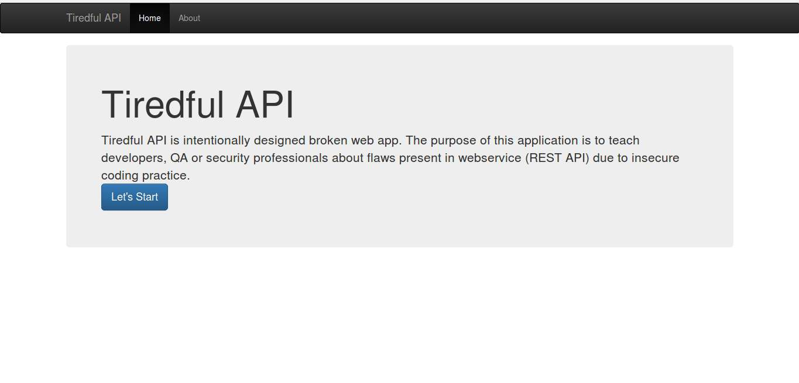

### What is Tiredful API?

Tiredful API is an intentionally designed broken app that aims to educate developers, QA professionals, and security experts about vulnerabilities present in web services (REST APIs) due to insecure coding practices.

I developed this project together with my grouo in the Devsecops Cybergirls 4.0 Cohort to demonstrate how to build secure Docker images. We focused on several key aspects:

- **Security Scans**: We utilized tools such as Safety, Hadolint, and Snyk to scan for and fix security vulnerabilities within our Docker images. These tools help identify issues related to dependencies, Dockerfile best practices, and known vulnerabilities.

- **Non-Root User**: To enhance security, we ensured that the Dockerfile runs applications as a non-root user. This minimizes the risk of privilege escalation attacks.

- **Minimal Base Image**: We chose a minimal base image for our Docker containers, reducing the attack surface and limiting the potential vulnerabilities that could be exploited.



### Who can use Tiredful API?
* Web Developers
* Web Pentesters
* Security Professionals
* Students

  
# Tiredful App Deployment

## Prerequisites

Before you begin, ensure you have the following installed:

- [Docker](https://docs.docker.com/engine/install/)
- [Kind](https://kind.sigs.k8s.io/docs/user/quick-start/#installation)
- [kubectl](https://kubernetes.io/docs/tasks/tools/install-kubectl/)

## Deployment Instructions

## 1. Clone the repository:
   ```bash
   git clone https://github.com/Natalie-A/Tiredful.git
   cd Tiredful
   ```

## 2. Deploy Locally
   ```bash
   chmod +x deploy.sh
   ./deploy.sh
   ```

## 3. Test
Open a browser and go to URL
```
http://localhost:30000                           
```
